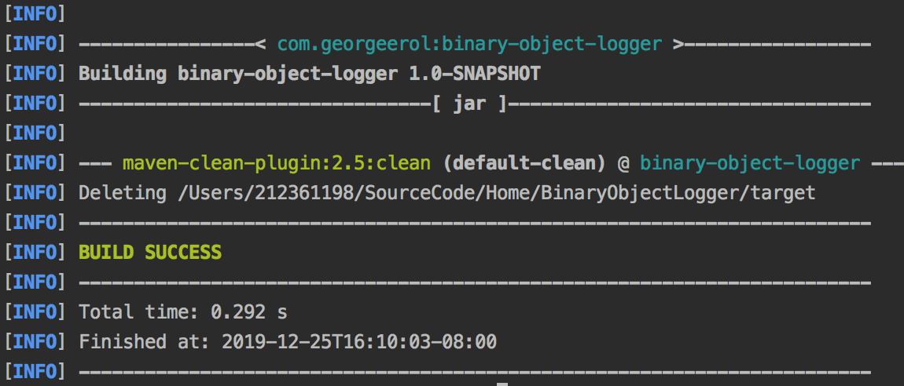
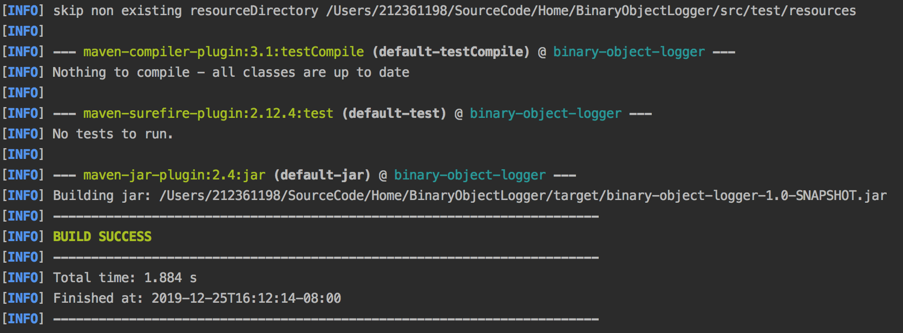

# Binary Object Logger Implementation
[](https://travis-ci.com/georgeerol/BinaryObjectLogger)

## Problem
Using given interface and abstract class definitions, implement a Binary Object Logger. The basic idea is to have a binary object logger class instantiated with a file path where the log will be written. The write method accepts objects implementing a "binary loggable" interface that defines methods for writing and reading those objects to/from an array of bytes. Binary object logger will write such objects into a given binary file, and it will support reading objects back from the binary file in an iterative fashion. You should come up with a binary file schema that supports this interface.
Your implementation should be simple, robust, and with minimal overhead, so that it could be used in a performance-critical environment. This means minimal CPU and memory resources used when logger writes into the log or reads from the log. You do not have to worry about multiple threads trying to write into the same binary logger.


###  BinaryLogger interface looks as follows:

```java
/**
 * BinaryLogger logs serialized instances of {@link BinaryLoggable} into
file.
 * It does so in such a way that it is possible to stream these
instances back
 * in an iterative fashion via the {@link #read(File, Class)} method.
 */
public abstract class BinaryLogger<T extends BinaryLoggable> implements
AutoCloseable {
   protected File outputFile;
   public BinaryLogger(File file) {
       this.outputFile = file;
}
  /**
   * Writes the serialized instance.
   *
   * @param loggable an instance of {@code BinaryLoggable} that needs to
be logged
   * @throws IOException if any IO operation fails
   */
   abstract void write(T loggable) throws IOException;
   /**
   * Read and iterate through instances persisted in the given file.
   *
   * @param clazz a class of the type T, clazz should have a public
no-arg constructor
   * @throws IOException if any IO operation fails
   */
   abstract Iterator<T> read(Class<T> clazz) throws IOException;
}

```
### BinaryLoggable interface is:
```java
/**
 * BinaryLoggable represents an entity that can be logged by {@code
BinaryLogger}.
 */
public interface BinaryLoggable {
  /**
   * Serialize the fields of this object into a byte array.
   */
   byte[] toBytes() throws IOException;
  /**
   * Deserialize the fields of this object from given byte array.
   */
   void fromBytes(byte[] rawBytes) throws IOException;
}
```

# Run the Project
## To run the project from command line
To build and compile the project via the command line do a  maven `clean` and then `package`
### Maven Clean
```bash
$ mvn clean
```
#### Maven Response:


### Maven Package
```bash
$ mvn package
```
#### Maven Response:

